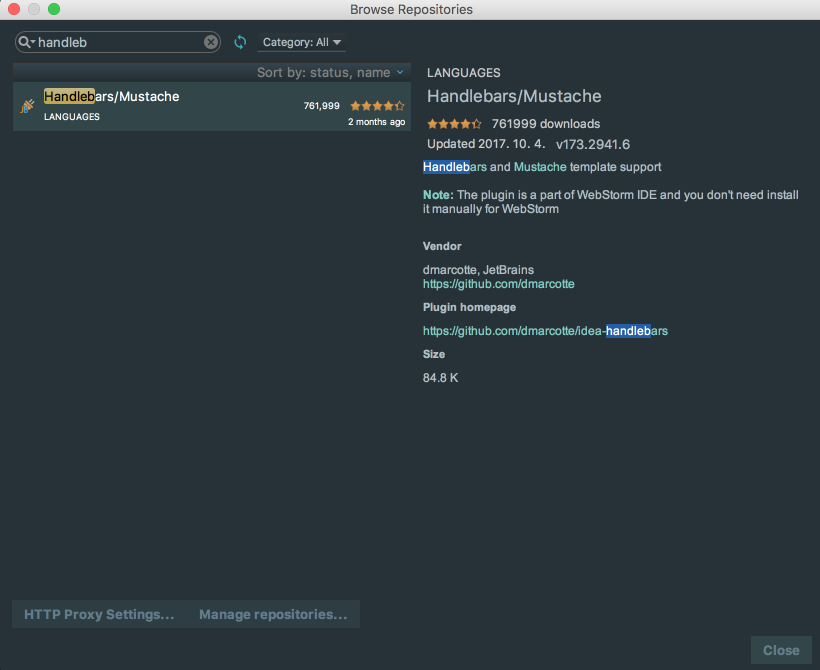
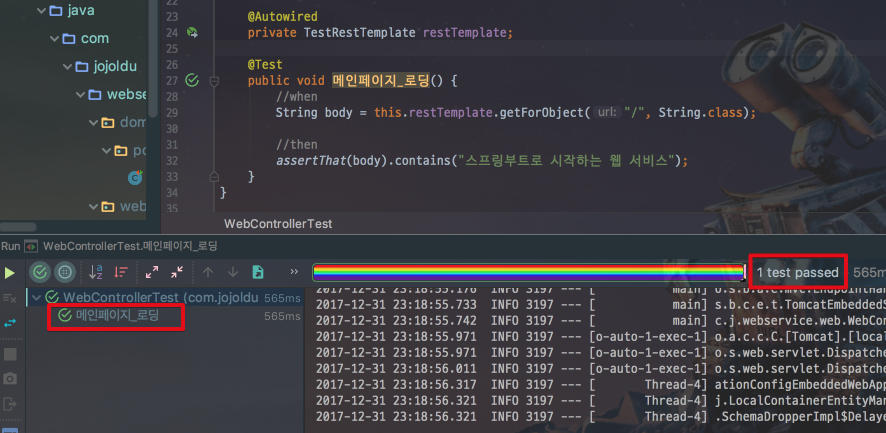
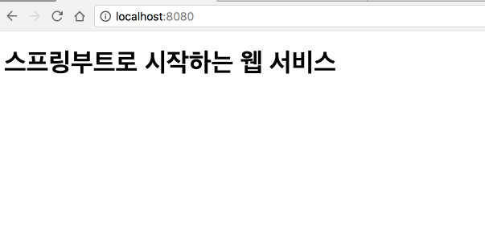

# 3. SpringBoot & Handlebars로 화면 만들기 

이번 시간엔 SpringBoot & Handlebars로 간단한 화면을 만들 예정입니다.  
Handlebars는 흔히 사용하시는 Freemarker, Velocity와 같은 서버 템플릿 엔진입니다.  
JSP는 서버 템플릿 역할만 하지 않기 때문에 JSP와 완전히 똑같은 역할을 한다고 볼순 없지만, 순수하게 **JSP를 View 용으로만 사용하실때는 똑같은 역할**이라고 보시면 됩니다.  
  
결국 URL 요청시, 파라미터와 상태에 맞춰 적절한 HTML 화면을 생성해 전달하는 역할을 하는것으로 보시면 됩니다.

> Tip)  
JSP, Freemarker, Velocity가 몇년동안 업데이트가 안되고 있어 사실상 SpringBoot에선 권장하지 않는 템플릿엔진입니다.  
(Freemarker는 프리뷰버전은 계속나오고 있는데 릴리즈버전이 2015년이 마지막입니다.)  
현재까지도 꾸준하게 업데이트 되고 있는 템플릿 엔진은 Thymeleaf, Handlebars 이며 이 중 하나를 선택하시면 됩니다.  
개인적으로는 Handlebars를 추천합니다.  
(Spring 진영에선 Thymeleaf를 밀고 있습니다.)  
(1) 문법이 다른 템플릿엔진보다 간단하고  
(2) 로직 코드를 사용할 수 없어 **View의 역할과 서버의 역할을 명확하게 제한**할 수 있으며  
(3) Handlebars.js와 Handlebars.java 2가지가 다 있어, 하나의 문법으로 클라이언트 템플릿/서버 템플릿을 모두 사용할 수 있습니다.  
개인적으로 **View 템플릿엔진은 View의 역할에만 충실**하면 된다고 생각합니다.  
너무 많은 기능을 제공하면 API와 View템플릿엔진, JS가 서로 로직을 나눠갖게 되어 유지보수하기가 굉장히 어렵습니다. 

## 3-1. Handlebars 연동

Handlebars는 아직 정식 SpringBoot starter 패키지가 존재하진 않지만, 많은 분들이 사용중이신 라이브러리인 [handlebars-spring-boot-starter](https://github.com/allegro/handlebars-spring-boot-starter)가 있어 이를 사용할 예정입니다.  
(정식 패키지에 포함시켜도 될텐데 SpringBoot에서 왜 안넣는지가 궁금하긴 하네요.)  
  
### 의존성 추가

build.gradle에 다음과 같이 의존성을 추가합니다.


```groovy
compile 'pl.allegro.tech.boot:handlebars-spring-boot-starter:0.2.15'
```

의존성 하나만 추가하면 기존에 다른 스타터 패키지와 마찬가지로 추가 설정없이 설치가 끝입니다.  
다른 서버 템플릿 스타터 패키지와 마찬가지로 Handlebars도 기본 경로는 src/main/resources/templates가 됩니다.  
  
> Tip)  
스프링부트는 디폴트 설정이 굉장히 많습니다.  
기존의 스프링처럼 개인이 **하나하나 설정 코드를 다 작성할 필요가 없습니다**.  
스프링부트를 쓰면 많은 설정을 생략할 수 있습니다.  
영상을 참고하셔서 이런 점들은 숙지하시면 좋을것 같습니다.  
[권용근 - 스프링부트를 대하는 자세](https://www.youtube.com/watch?v=52i6gHnS1_g)

> Tip)  
혹시 IntelliJ를 사용중이시라면 아래와 같이 Handlebars 플러그인을 설치하면 문법체크 등과 같이 많은 지원을 받을 수 있습니다.



### 메인 페이지 생성

실제로 사용할 Handlebars 파일을 생성하겠습니다.   src/main/resources/templates에 **main.hbs** 파일을 생성합니다.

```html
<!DOCTYPE HTML>
<html>
<head>
    <title>스프링부트 웹서비스</title>
    <meta http-equiv="Content-Type" content="text/html; charset=UTF-8" />
    <meta name="viewport" content="width=device-width, initial-scale=1" />

</head>
<body>
    <h1>스프링부트로 시작하는 웹 서비스</h1>
</body>
</html>
```

메인페이지가 생성되었으니, URL요청시 main.hbs 파일을 호출할수 있도록 Controller을 만들겠습니다.  
web패키지 안에 webController를 만들겠습니다.  

```java
@Controller
@AllArgsConstructor
public class WebController {

    @GetMapping("/")
    public String main() {
        return "main";
    }
}
```

Spring 4.3 부터는 ```@RequestMapping```을 대체할 수 있는 여러 매핑 어노테이션이 추가 되었습니다.  
위에서 나온 ```@GetMapping```은 이전으로 보면 ```@RequestMapping(value="/", method = RequestMethod.GET)```과 동일합니다.  
  
handlebars-spring-boot-starter 덕분에 컨트롤러에서 문자열을 반환할때 앞의 path와 뒤의 파일 확장자는 자동으로 지정됩니다.  
(prefix: src/main/resources/templates, suffix: .hbs)  
즉 여기선 ```"main"```을 반환하니, src/main/resources/templates/main.hbs로 전환되어 View Resolver가 처리하게 됩니다.  
(ViewResolver는 URL 요청의 결과를 전달할 타입과 값을 지정하는 관리자 격으로 보시면 됩니다.)  
  
자 여기까지 코드가 완성되었으니, 잘 되는지 확인해봐야 합니다.  
이전 포스팅과 마찬가지로 이번에도 테스트 코드로 검증해보겠습니다.

### 메인 페이지 테스트 코드

src/**test**/java/com/jojoldu/webservice/web에 WebControllerTest 클래스를 생성하겠습니다.

```java
import static org.assertj.core.api.Assertions.assertThat;
import static org.springframework.boot.test.context.SpringBootTest.WebEnvironment.RANDOM_PORT;

@RunWith(SpringRunner.class)
@SpringBootTest(webEnvironment = RANDOM_PORT)
public class WebControllerTest {

    @Autowired
    private TestRestTemplate restTemplate;

    @Test
    public void 메인페이지_로딩() {
        //when
        String body = this.restTemplate.getForObject("/", String.class);

        //then
        assertThat(body).contains("스프링부트로 시작하는 웹 서비스");
    }
}
```

이번 테스트는 실제로 URL 호출시 제대로 페이지가 호출되는지에 대한 테스트입니다.  
HTML도 결국은 규칙이 있는 문자열입니다.  
TestRestTemplate를 통해 "/"로 호출했을때 **main.hbs에 포함된 코드들이 있는지 확인**하면 됩니다.  
  
전체 코드를 다 찾을 필요는 없으니, ```"스프링부트로 시작하는 웹 서비스"```문자열이 포함되어 있는지만 비교하겠습니다.  
  


오! 테스트가 통과됐습니다.  
그럼 실제로 화면이 잘 나오는지 한번 보겠습니다.  
Application의 메인메소드를 실행하고 localhost:8080 으로 접속해보겠습니다.



짠 정상적으로 화면이 노출되는게 확인 됩니다!

## 3-2. Ajax

> Tip)  
실제로 데이터의 조회는 FK의 조인, 복잡한 조건등으로 인해 이런 Entity 클래스만으로 처리하기 어려워 조회용 프레임워크를 추가로 사용합니다.  
대표적 예로 querydsl, jooq, MyBatis 등이 있습니다.  
조회는 위 3가지 프레임워크중 하나를 통해 조회하고, 등록/수정/삭제 등은 SpringDataJpa를 통해 진행합니다.  
(개인적으로는 querydsl를 강추합니다.)  
JPA, querydsl에 대한 더 자세한 내용은 [김영한님의 자바 ORM 표준 JPA 프로그래밍](http://www.yes24.com/24/goods/19040233) 을 참고하시면 아주 좋습니다.


