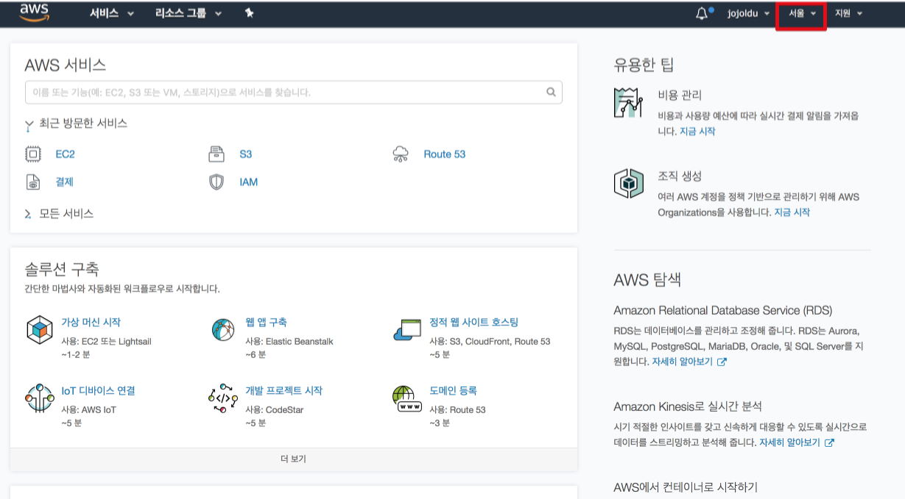
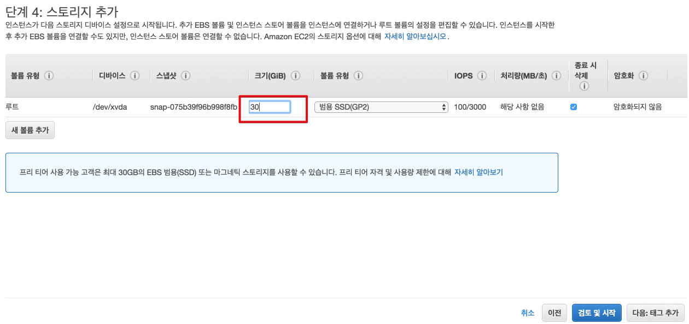
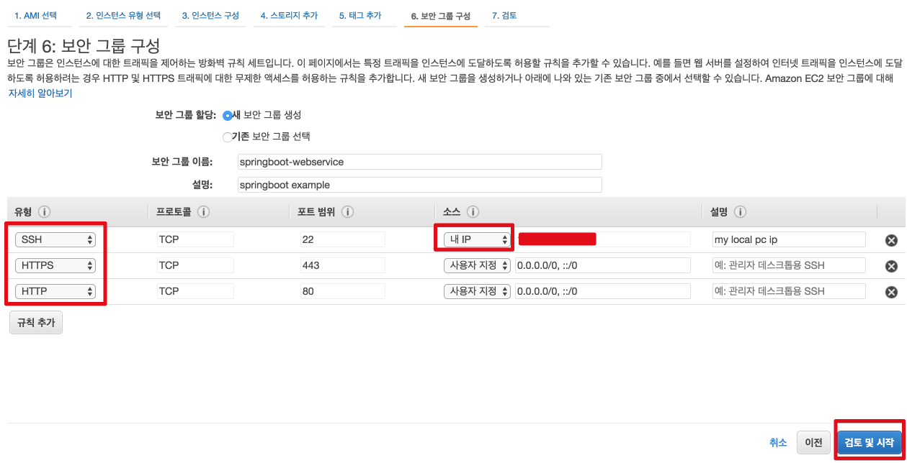
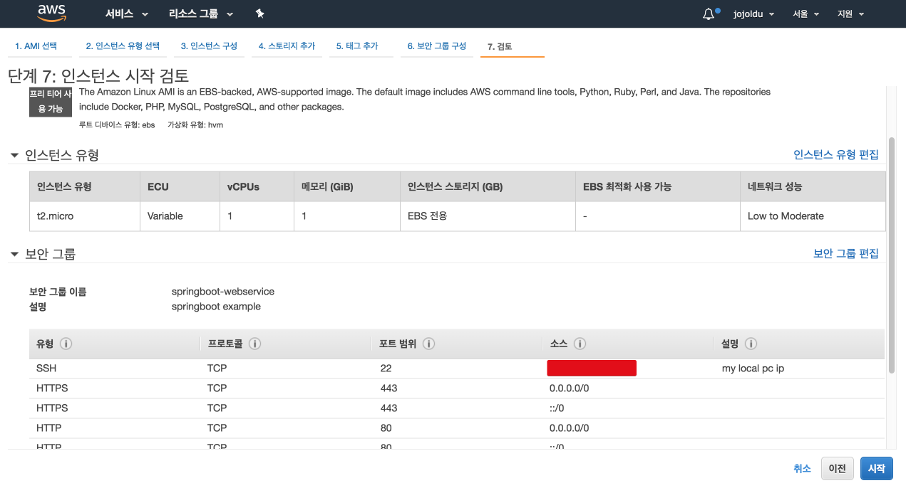
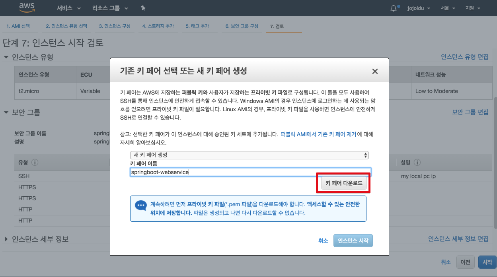
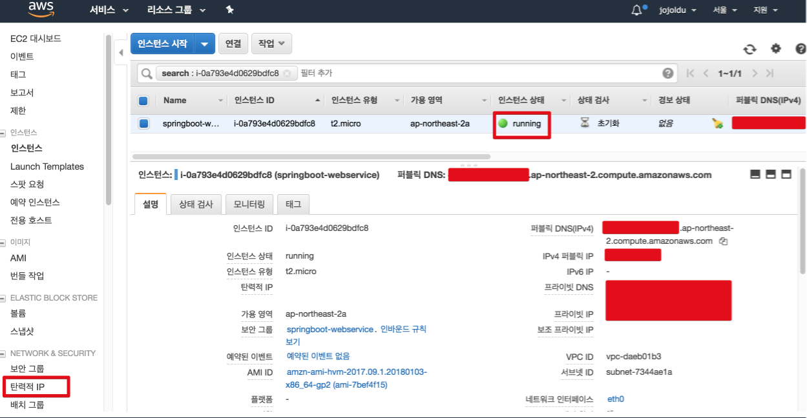
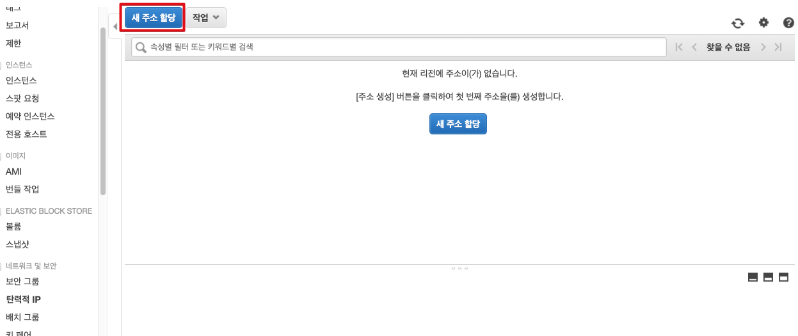
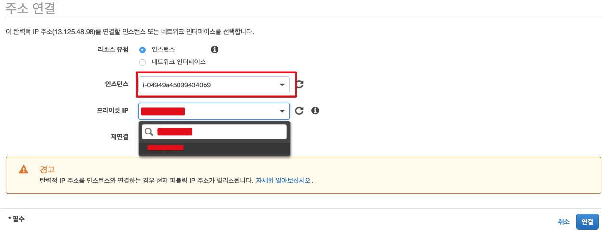
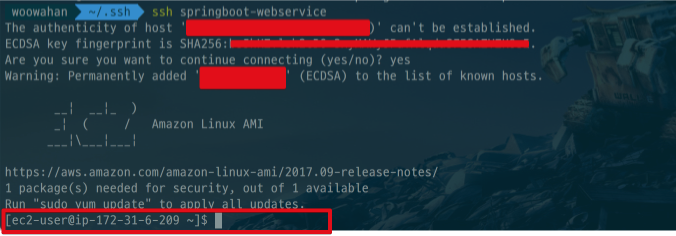
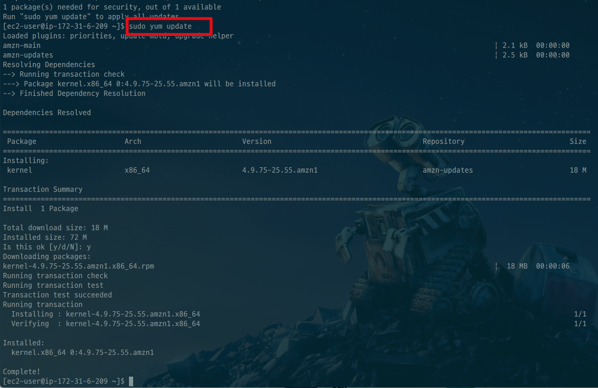

# 4. AWS 운영환경 구축하기

이번 시간엔 SpringBoot를 운영할 AWS 환경을 구축하겠습니다.
(모든 코드는 [Github](https://github.com/jojoldu/springboot-webservice/tree/feature/4)에 있습니다.)  

> Tip)  
운영 서버는 크게 클라우드 서비스(AWS, Azure 등) 과 호스팅 서비스(Cafe24, 코리아호스팅 등)을 이용하시면 됩니다.  
비용은 일반적으로 호스팅 서비스가 훨씬더 저렴합니다.  
(24시간중 특정 시간에만 트래픽이 급격히 올라가는 경우가 아니라, **전반적으로 일정한 트래픽이 유지**된다는 가정하에 입니다.)  
하지만 여기서는 호스팅 서비스를 쓰지 않고 클라우드 서비스인 AWS를 사용하겠습니다.  
많은 서비스 기업들이 **클라우드 환경으로 이전중**이기 때문에 이직하실때도 큰 도움이 되실꺼라 생각합니다.

## 4-1. AWS EC2 생성하기

기본적으로 AWS 계정이 있다는 가정하에 시작합니다.  
혹시나 AWS 자체가 처음이시라면 [생활코딩 AWS 강좌](https://opentutorials.org/course/2717)를 꼭꼭! 참고하시길 추천드립니다.  
최대한 스크린샷으로 따라하기 쉽게 진행하겠습니다.

### 1) 인스턴스 생성

AWS에 가입하신뒤, 로그인 하시면 아래와 같은 화면이 등장합니다.  
우측 상단의 Region을 확인하시고, 서울이 아니라면 **서울**로 변경합니다.  



AWS 서비스에서 EC2를 검색해서 EC2 대시보드로 이동합니다.


EC2 대시보드 중앙에 있는 **인스턴스 시작** 버튼을 클릭해서 생성페이지로 이동합니다.


EC2의 운영체제를 선택하는 화면인데, 여기서 저희는 Amazon Linux를 선택합니다.  
(내부적으로 Centos와 동일하기 때문에 Centos라고 보셔도 됩니다.) 


인스턴스 유형은 프리티어를 지원하는 **t2.micro**를 선택하고, **다음:인스턴스 세부 정보 구성** 버튼을 클릭합니다.


네트워크, 서브넷에선 디폴트값을 그대로 사용합니다.  
**다음:스토리지 추가**를 클릭합니다.


스토리지란, 로컬PC의 디스크와 같은 저장장치를 얘기합니다.  
기본값으로 8GB가 되어있을텐데요.  
30GB까지가 프리티어로 사용할수 있기 때문에 **30**으로 변경합니다.  
변경하셨으면 **다음:태그 추가** 버튼을 클릭합니다.



태그는 인스턴스에 할당하는 키 값을 얘기합니다.  
여러 인스턴스들이 있을 경우 이를 태그별로 구분하면 검색이나 그룹짓기 편하기 때문에 여기서 본인 서비스의 인스턴스를 나타낼 수 있는 값으로 등록합니다.  
**다음:보안 그룹 구성**을 클릭합니다.


이 보안그룹 부분이 굉장히 중요한 부분입니다.  
보통 AWS 요금이 100만원, 300만원이 넘게 청구되는 대부분의 경우가 이 보안그룹을 잘못설정해서 타인이 무단으로 접속하여 발생한 경우입니다.  
유형 SSH, 22포트는 AWS EC2에 터미널로 접속할때를 얘기합니다.  
지정된 IP외에는 접근을 차단하기 때문에 귀찮다고 전체 오픈 (```0.0.0.0/0, ::/0```)해버리면 바로 외국분들의 비트코인 채굴이 본인 EC2 서버에서 진행되고 있음을 확인할 수 있습니다.  
그래서 본인 집의 IP를 기본적으로 추가하고 (내 IP를 선택하면 현재 접속한 장소의 IP가 자동 지정됩니다.)  
카페와 같은 **집 외에 다른 장소에서 접속하실땐 해당 장소의 IP를 다시 SSH 규칙을 추가**하시는게 안전합니다.  



HTTPS, HTTP는 외부에서 이 사이트의 웹서비스 접근할때 사용하는 유형이기 때문에 80, 443 포트를 열어놓습니다.  
(이걸 닫으면 외부에서 서비스에 접근을 못하게 됩니다.)  
  
보안 규칙이 다 등록되셨으면 **검토 및 시작** 버튼을 클릭합니다.  
  
아래와 같이 등록 정보를 잘 확인후, **시작** 버튼을 클릭합니다.



**시작** 버튼을 클릭하시면 키페어 생성 Modal이 등장합니다.  
이 키페어를 갖고 있어야만 해당 인스턴스에 접근이 가능하기 때문에 잘 보관하셔야 합니다.  



pem키를 다운 받으신뒤, **인스턴스 시작** 버튼을 클릭합니다.  
아래와 같이 인스턴스 ID를 클릭하시면 생성한 인스턴스 페이지로 이동합니다.  

 

짠 이렇게 인스턴스 상태가 running가 되면 정상적으로 인스턴스가 생성 & 실행된것입니다.

 

이대로 두면 EC2 인스턴스에 고정 IP가 할당된 상태가 아니라서, **인스턴스를 재시작할때마다 새 IP가 할당**되서 도메인 연결을 할수가 없게 됩니다.  
그래서 고정 IP를 할당하겠습니다.

### 2) EIP 등록

AWS의 고정 IP를 Elastic IP라고 하는데요.  
EC2 인스턴스 페이지의 좌측을 보시면 **탄력적IP**라고 있습니다.  
해당 버튼을 클릭하겠습니다.  
  
**새주소 할당** 버튼을 클릭합니다.



**할당** 버튼을 클릭합니다.  


그럼 아래와 같이 고정 IP가 생성됩니다.


**닫기** 버튼을 클릭하신뒤, 방금 생성한 탄력적 IP를 우클릭하신뒤 **주소 연결**을 선택합니다.


아래와 같이 **인스턴스에는 방금 생성한 EC2 인스턴스를** 선택하고, **프라이빗 IP에는 방금 생성한 탄력적 IP**를 선택하신뒤, **연결**버튼을 클릭합니다.



자 연결이 완료되셨으면, 인스턴스 탭을 클릭하셔서 탄력적 IP가 할당되었는지 확인합니다.


여기까지 하셨으면 EC2 인스턴스 생성과정은 끝났습니다!  
자 이제 그럼 로컬 PC에서 EC2 인스턴스로 접속해보겠습니다.

### 3) EC2 터미널 접속

여기서부터는 맥북을 기준으로 진행됩니다.  
맥, 리눅스가 아닌 윈도우 PC를 사용중이시라면 아래 링크를 참고하셔서 환경 설정을 진행하시면 됩니다.  

* [Window에서 EC2 접근하기](http://pyrasis.com/book/TheArtOfAmazonWebServices/Chapter07/02)

AWS와 같은 외부 서버로 SSH 접속을 하기 위해선 매번 ```ssh -i pem키 외부 IP```를 입력해야합니다.  
상당히 귀찮기 때문에 쉽게 ssh 접속을 할수있도록 설정하겠습니다.  

좀전에 받은 키페어 pem파일을 ```~/.ssh/```로 복사합니다.


그리고 pem 키 권한을 변경합니다.


```bash
chmod 600 본인pem키위치
```

pem키가 있는 ```~/.ssh``` 디렉토리에 ```config```파일을 생성합니다.  
(아무런 확장자가 없습니다.)

```bash
vim config
```

아래와 같이 본인이 원하는 Host로 등록합니다.  
Host가 앞으로 접속할 키값으로 보시면 됩니다.  
(예를 들어 ```Host abc```로 등록하시면 ```ssh abc```로 해당 EC2로 접속할수 있게 됩니다.)  
Host외에 **HostName은 탄력적 IP** 주소를 쓰시면 됩니다.


```bash
 ############################
 ###### springboot-webservice
 Host 본인이 원하는 이름
       HostName 탄력적IP
       User ec2-user
       IdentityFile ~/.ssh/pem키
```

(AWS에서 Ubuntu를 선택하셨으면 기본 사용자가 ubuntu이며, 그외에는 ec2-user입니다.)  

작성이 끝나셨으면 ```:wq```로 저장 & 종료 하신뒤, 아래처럼 config 파일이 생성되었으면 성공입니다!


자 그럼 한번 EC2 인스턴스에 접속해보겠습니다.  
터미널에서 아래와 같이 ssh 접속을 시도합니다.

```bash
ssh 등록한Host값
```

> Tip)  
혹시나 오랜시간 접속이 안되거나, 권한이 없어서 안된다고 메세지가 나온다면  
(1) HostName값이 정확히 탄력적IP로 되어있는지  
(2) EC2 인스턴스가 running 상태인지  
(3) EC2 인스턴스의 보안그룹 -> 인바운드 규칙에서 현재 본인의 IP가 등록되어있는지  
확인해보시길 추천드립니다.

이렇게 EC2 인스턴스에 접속되는것을 확인할 수 있습니다!



멜트다운 때문인지 커널 업데이트 하라는 메세지가 보이니, 업데이트를 진행합니다.

```bash
sudo yum update
```




EC2 관련된 설정이 모두 끝이났습니다!  
바로 RDS 설정을 진행하겠습니다.

## 4-2. AWS RDS 생성하기

## 4-3. SpringBoot 배포


