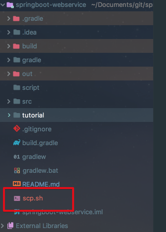
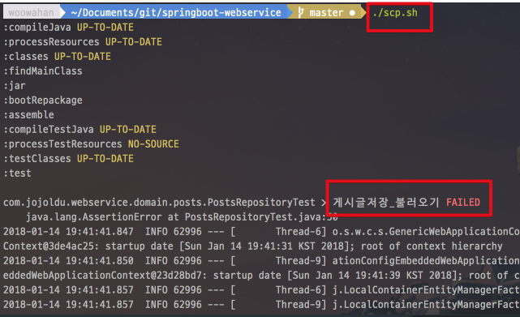
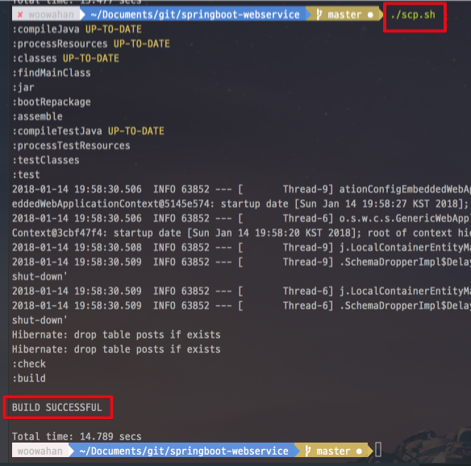
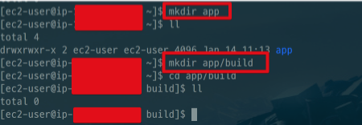
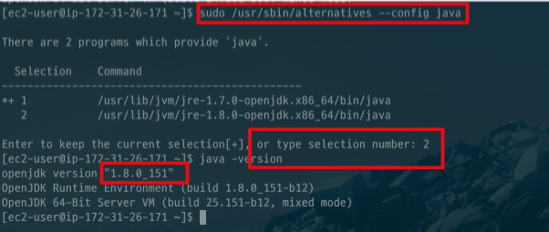

# 5. TravisCI & AWS CodeDeploy로 배포 환경 구축하기

이번 시간엔 개발한 프로젝트를 배포할 수 있는 배포환경을 구축하겠습니다.
(모든 코드는 [Github](https://github.com/jojoldu/springboot-webservice/tree/feature/5)에 있습니다.)  


## 5-1. AWS에 스프링부트 수동 배포하기

간단하게 EC2에 저희의 스프링 부트 프로젝트를 배포할 수 있도록 스크립트를 하나 만들겠습니다.  
(계속 이렇게 하진 않습니다. 차후 과정에서 좀 더 편안한 방법을 소개드리겠습니다.)

### 5-1-1. scp 스크립트 생성

먼저 저희 프로젝트를 Build 하는 명령어를 추가하겠습니다.  
프로젝트 내부에 scp.sh 파일을 하나 생성해서 다음과 같은 내용을 추가합니다.

```bash
#!/bin/bash

../gradlew build
```



그리고 scp.sh 파일을 실행시킬수 있도록 권한을 추가합니다.  

```bash
chmod 755 ./scp.sh
```


> Tip)  
chmod의 자세한 내용을 알고싶으시다면 [유닉스 파일 권한 변경하기(chmod)](http://ohgyun.com/327)를 참고하세요!

스크립트가 생성되었으니 한번 실행해보겠습니다.

```bash
./scp.sh
```



앗 테스트가 깨져서 Build가 실패했습니다.  
왜 테스트가 깨졌을까요?

### 5-1-2. 깨진 테스트 수정

이전 시간에 WebController를 테스트하기 위해 저희는 application.yml에 다음과 같이 ```insert``` 쿼리를 실행시키도록 옵션을 추가했습니다.  
  
src/**main**/resources/application.yml

```yaml
...
# local 환경
---
spring:
  profiles: local
  datasource:
    data: classpath:data-h2.sql # 시작할때 실행시킬 script
  ...
```

스프링부트에서는 src/test/resources/application.yml이 없을 경우 main의 application.yml 옵션을 그대로 가져와서 사용하게 됩니다.  
테스트 코드는 **외부의 영향 없이 수행**되야하기 때문에 이 부분을 수정하겠습니다.  
  
src/**test/resources/application.yml을 생성해서 다음과 같이 작성합니다.

```yaml
# Test
spring:
  profiles:
    active: local # 기본 환경 선택

# local 환경
---
spring:
  profiles: local
  jpa:
    show-sql: true
```


수정후 다시 scp.sh 파일을 실행시키면!



Build가 성공됩니다.  
Build가 성공되시면 build 디렉토리가 생성되고, **build/libs/프로젝트-버전.jar 라는 Build 파일이 생성**됩니다.


이 jar파일을 EC2 서버에 전송해서 실행시키면 프로젝트가 운영 서버에 배포된 것입니다.  

> Tip)  
실제 회사에서 이렇게 수행하진 않습니다.  
어디까지나 극적인 효과를 위해 지금은 수동으로 진행중이니 조금만 참아주세요!

### 5-1-3. build 파일 EC2에 전송

build 파일을 보관할 수 있도록 EC2 서버에 디렉토리 하나를 생성하겠습니다.  
EC2 서버에 접속하시고,

```bash
ssh springboot-webservice
```

아래 명령어로 ```/home/ec2-user/app/build``` 디렉토리를 생성합니다.

```bash
mkdir app
mkdir app/build
```



자 그리고 다시 로컬의 프로젝트로 돌아와서 scp.sh에 다음과 같은 명령어를 추가합니다.

```bash
#!/bin/bash

./gradlew build

echo "Build가 완료되었습니다. EC2에 전송합니다."

scp -i ~/.ssh/본인의 EC2 pem키 위치 ./build/libs/*.jar ec2-user@EC2 탄력적IP(EIP)주소:/home/ec2-user/app/build/
```

scp는 ssh 통신으로 파일을 복사하는 명령어 입니다.  

* ```-i``` 옵션으로 pem키 파일 위치를 전달
  * Ex) ```~/.ssh/springboot-webservice.pem```
* ```*.jar``` 로 지정해, build 파일명이 변경(ex: 버전업 등)되도 실행될수 있도록 .jar확장자를 가지면 대상이 되도록 지정
* 좀전에 만든 EC2서버의 /app/build/ 디렉토리에 jar 복사

작성이 완료되셨으면 아래처럼 scp.sh 파일을 다시 실행해봅니다.


전송이 완료되셨으면, EC2 서버에 jar 파일이 잘 도착했는지 확인해봅니다.


전송이 잘 된것이 확인됩니다!  
그럼 한번 실행해보겠습니다.  

### 5-1-4. Java 8 설치

현재(2018.01.14) EC2가 Java7이 기본버전이라 Java8로 버전업하겠습니다.  
  
AWS EC2에 접속하셔서 아래 명령어를 실행 합니다.

```bash
sudo yum install -y java-1.8.0-openjdk-devel.x86_64
```

설치가 완료되셨으면 인스턴스의 Java 버전을 8로 변경하겠습니다.

```bash
sudo /usr/sbin/alternatives --config java
```



버전이 변경되셨으면 사용하지 않는 Java7을 삭제합니다.

```bash
sudo yum remove java-1.7.0-openjdk
```

### 5-1-5. Jar 실행


> Tip)  
스프링부트의 장점 중 하나로, 특별히 외장 톰캣을 설치할 필요가 없습니다.  
내장 톰캣을 사용해서 jar 파일만 있으면 바로 웹 어플리케이션 서버가 실행할수 있습니다.  
좀 더 자세한 스프링부트의 장점을 알고 싶으시면 이전에 작성한 [SpringBoot의 깨알같은 팁](http://jojoldu.tistory.com/43)을 참고하시면 도움되실것 같습니다.
