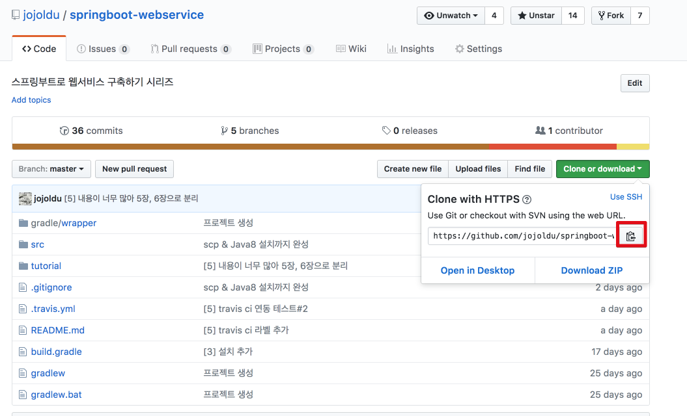
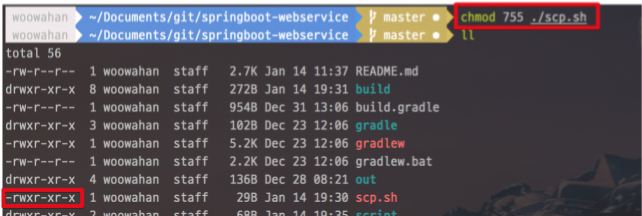
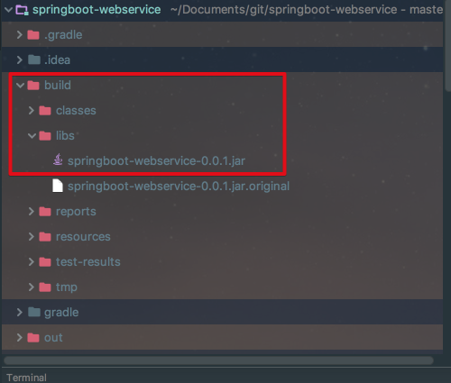
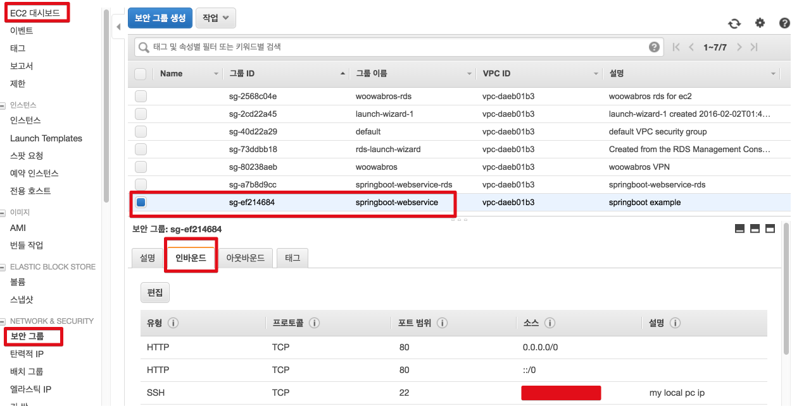
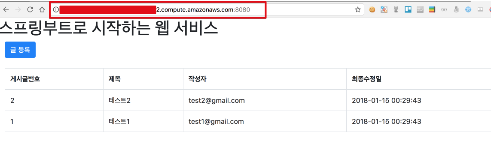

# 5. EC2 배포

이번 시간엔 지금까지 개발한 내용을 EC2에 배포 해보겠습니다.
(모든 코드는 [Github](https://github.com/jojoldu/springboot-webservice/tree/feature/5)에 있습니다.)  


## 5-1. EC2에 Git 설치 및 프로젝트 Clone

먼저 EC2에 Git을 설치하겠습니다.  
Linux에서 Git 설치는 아주 간단합니다.  
  
### 5-1-1. Git 설치 및 Clone

EC2 인스턴스로 ssh 접속하신뒤, yum패키지 매니저를 통해 아래 명령어를 실행하신뒤 진행중 나오는 질문에는 ```y```를 입력하시면 됩니다.  

```bash
sudo yum install git
```

설치가 완료되셨으면 아래 명령어로 설치 상태도 확인합니다.

```bash
git --version
```

git이 성공적으로 설치되셨으면 git clone을 받을 디렉토리를 생성하겠습니다.

```bash
mkdir app
mkdir app/git
```

생성된 ```git```디렉토리로 이동하고,

```bash
cd ~/app/git
```

본인의 github 웹페이지에서 ssh 주소를 복사합니다.



복사한 ssh 주소를 통해 ```git clone```을 진행합니다.

```bash
git clone https://github.com/프로젝트주소.git
```


git clone이 끝나셨으면 clone된 프로젝트로 이동(```cd 프로젝트명```) 해서 ```ll``` 혹은 ```ls -al```로 파일들이 잘 복사되었는지 확인합니다.  


(```git branch -a```를 하시면 현재 브랜치도 확인할 수 있습니다.  
현재 master 브랜치로 되어있습니다.)  
  
자 그럼 프로젝트가 잘 받아졌는지 확인하기 위해 테스트를 수행해보겠습니다.

```bash
./gradlew test
```


앗 테스트가 깨졌습니다.  
왜 깨졌을까요?

### 5-1-2. 깨진 테스트 수정

지난 4번째 과정에서 WebController를 테스트하기 위해 저희는 application.yml에 다음과 같이 ```insert``` 쿼리를 실행시키도록 옵션을 추가했습니다.  
  
src/**main**/resources/application.yml

```yaml
...
# local 환경
---
spring:
  profiles: local
  datasource:
    data: classpath:data-h2.sql # 시작할때 실행시킬 script
  ...
```

스프링 부트에서는 src/test/resources/application.yml이 없을 경우 main의 application.yml 옵션을 그대로 가져와서 사용하게 됩니다.  
테스트 코드는 **외부의 영향 없이 수행**되야하기 때문에 이 부분을 수정하겠습니다.  
**로컬PC에서 프로젝트 코드를 수정**합니다.  
(EC2에서 고치는게 아닙니다.)  
  
src/**test/resources/application.yml을 생성해서 다음과 같이 작성합니다.

```yaml
# Test
spring:
  profiles:
    active: local # 기본 환경 선택

# local 환경
---
spring:
  profiles: local
  jpa:
    show-sql: true
```


수정후 다시 master 브랜치로 commit & push 합니다.  
push가 끝나시면 다시 EC2로 이동해 git pull을 받습니다.

```bash
cd ~/app/git/프로젝트명
git pull
```


프로젝트를 git을 통해 잘 가져왔습니다.  
이제 이 프로젝트를 통해 빌드와 프로젝트 실행까지 진행하겠습니다.

## 5-2. 배포 스크립트 생성

작성한 코드를 실제 서버에 반영하는것을 **배포**라고 합니다.  
여기서는 배포라 하면 다음의 과정을 모두 합친 뜻이라고 보시면 됩니다.

* git clone 혹은 git pull을 통해 새 버전의 프로젝트 받음
* Gradle / Maven을 통해 프로젝트 Test & Build
* EC2 서버에서 해당 프로젝트 실행 및 재실행

위 과정을 **배포시마다 개발자가 하나하나 명령어**를 실행하는 것은 불편함이 많습니다.  
그래서 이를 쉘 스크립트로 작성해 스크립트만 실행하면 위 과정이 차례로 진행되도록 하겠습니다.

### 5-2-1. deploy 스크립트 생성

EC2 인스턴스의 ```~/app/git/```에 ```deploy.sh``` 파일을 하나 생성합니다.

```bash
vim ~/app/git/deploy.sh
```

그리고 다음의 코드를 추가합니다.

```bash
#!/bin/bash

../gradlew build
```


그리고 scp.sh 파일을 실행시킬수 있도록 권한을 추가합니다.  

```bash
chmod 755 ./scp.sh
```



> Tip)  
chmod의 자세한 내용을 알고싶으시다면 [유닉스 파일 권한 변경하기(chmod)](http://ohgyun.com/327)를 참고하세요!

스크립트가 생성되었으니 한번 실행해보겠습니다.

```bash
./scp.sh
```


앗 테스트가 깨져서 Build가 실패했습니다.  
왜 테스트가 깨졌을까요?

### 5-2-2. 깨진 테스트 수정

이전 시간에 WebController를 테스트하기 위해 저희는 application.yml에 다음과 같이 ```insert``` 쿼리를 실행시키도록 옵션을 추가했습니다.  
  
src/**main**/resources/application.yml

```yaml
...
# local 환경
---
spring:
  profiles: local
  datasource:
    data: classpath:data-h2.sql # 시작할때 실행시킬 script
  ...
```

스프링부트에서는 src/test/resources/application.yml이 없을 경우 main의 application.yml 옵션을 그대로 가져와서 사용하게 됩니다.  
테스트 코드는 **외부의 영향 없이 수행**되야하기 때문에 이 부분을 수정하겠습니다.  
  
src/**test/resources/application.yml을 생성해서 다음과 같이 작성합니다.

```yaml
# Test
spring:
  profiles:
    active: local # 기본 환경 선택

# local 환경
---
spring:
  profiles: local
  jpa:
    show-sql: true
```


수정후 다시 scp.sh 파일을 실행시키면!


Build가 성공됩니다.  
Build가 성공되시면 build 디렉토리가 생성되고, **build/libs/프로젝트-버전.jar 라는 Build 파일이 생성**됩니다.



이 jar파일을 EC2 서버에 전송해서 실행시키면 프로젝트가 운영 서버에 배포된 것입니다.  

> Tip)  
실제 회사에서 이렇게 수행하진 않습니다.  
어디까지나 극적인 효과를 위해 지금은 수동으로 진행중이니 조금만 참아주세요!

### 5-2-3. build 파일 EC2에 전송

build 파일을 보관할 수 있도록 EC2 서버에 디렉토리 하나를 생성하겠습니다.  
EC2 서버에 접속하시고,

```bash
ssh springboot-webservice
```

아래 명령어로 ```/home/ec2-user/app/build``` 디렉토리를 생성합니다.

```bash
mkdir app
mkdir app/build
```


자 그리고 다시 로컬의 프로젝트로 돌아와서 scp.sh에 다음과 같은 명령어를 추가합니다.

```bash
#!/bin/bash

./gradlew build

echo "Build가 완료되었습니다. EC2에 전송합니다."

scp -i ~/.ssh/본인의 EC2 pem키 위치 ./build/libs/*.jar ec2-user@EC2 탄력적IP(EIP)주소:/home/ec2-user/app/build/
```

scp는 ssh 통신으로 파일을 복사하는 명령어 입니다.  

* ```-i``` 옵션으로 pem키 파일 위치를 전달
  * Ex) ```~/.ssh/springboot-webservice.pem```
* ```*.jar``` 로 지정해, build 파일명이 변경(ex: 버전업 등)되도 실행될수 있도록 .jar확장자를 가지면 대상이 되도록 지정
* 좀전에 만든 EC2서버의 /app/build/ 디렉토리에 jar 복사

작성이 완료되셨으면 아래처럼 scp.sh 파일을 다시 실행해봅니다.


전송이 완료되셨으면, EC2 서버에 jar 파일이 잘 도착했는지 확인해봅니다.


전송이 잘 된 것이 확인됩니다!  
그럼 한번 실행해보겠습니다.  

## 5-2. EC2에서 프로젝트 실행하기

### 5-2-1. Java 8 설치

현재(2018.01.14) EC2가 Java7이 기본버전이라 Java8로 버전업하겠습니다.  
  
AWS EC2에 접속하셔서 아래 명령어를 실행 합니다.

```bash
sudo yum install -y java-1.8.0-openjdk-devel.x86_64
```

설치가 완료되셨으면 인스턴스의 Java 버전을 8로 변경하겠습니다.

```bash
sudo /usr/sbin/alternatives --config java
```


버전이 변경되셨으면 사용하지 않는 Java7을 삭제합니다.

```bash
sudo yum remove java-1.7.0-openjdk
```

현재 버전이 Java8이 되었는지 확인합니다.

```bash
java -version
```

### 5-2-2. Jar 실행

Java8까지 설치되었으니 복사한 jar를 실행시켜보겠습니다.

```bash
nohup java -jar /home/ec2-user/app/build/springboot-webservice-0.0.1.jar &
```

> Tip)  
스프링부트의 장점 중 하나로, 특별히 외장 톰캣을 설치할 필요가 없습니다.  
내장 톰캣을 사용해서 jar 파일만 있으면 바로 웹 어플리케이션 서버가 실행할수 있습니다.  
좀 더 자세한 스프링부트의 장점을 알고 싶으시면 이전에 작성한 [SpringBoot의 깨알같은 팁](http://jojoldu.tistory.com/43)을 참고하시면 도움되실것 같습니다.

일반적으로 Java를 실행시킬때는 ```java -jar```라는 명령어를 사용하지만, 이렇게 할 경우 **사용자가 터미널 접속을 끊을 경우 어플리케이션도 같이 종료**가 됩니다.  
그래서 어플리케이션 실행자가 터미널을 종료시켜도 어플리케이션은 계속 구동될 수 있도록 ```nohup```명령어를 사용합니다.  
  
nohup은 실행시킨 jar파일의 로그 내용을 **nohup.out** 이란 파일에 남깁니다.  


nohup.out 파일이 생성되신게 확인 되시면, 아래 명령어로 잘 수행되었는지 확인합니다. 

```bash
tail -f /home/ec2-user/app/build/nohup.out
```


로컬에서 SpringBoot를 실행했을때와 마찬가지로 실행 로그를 확인할 수 있습니다.  
자 그러면 실제로 외부에서 접근해보겠습니다.

## 5-3. 외부에서 서비스 접속

일단 EC2의 스프링부트는 8080 포트로 실행되었습니다.  
그럼 우리의 EC2 인스턴스도 8080 포트가 외부에서 접근 가능하도록 열려있어야만 합니다.  
AWS EC2 인스턴스 페이지 -> 보안그룹 -> 현재 프로젝트의 인스턴스 -> 인바운드 탭을 클릭 합니다.



인바운드 **편집** 버튼을 클릭해서 다음과 같이 사용자지정(TCP), 8080 포트를 추가합니다.


> Tip)  
차후 Nginx 설치 과정이 끝나면 8080 포트는 제거하고, 80/443 포트만 열어놓습니다.  
Nginx를 통하지 않고, Tomcat에 바로 연락오는 요청은 모두 무시합니다.  

편집이 완료되셨으면 인스턴스의 퍼블릭 DNS로 브라우저에 접근해봅니다.


스프링부트가 8080포트로 열려있기 때문에 퍼블릭 DNS 뒤에 8080 포트를 붙여 접근합니다.



드디어 프로젝트가 외부에 노출되었습니다!

## 5-4. 