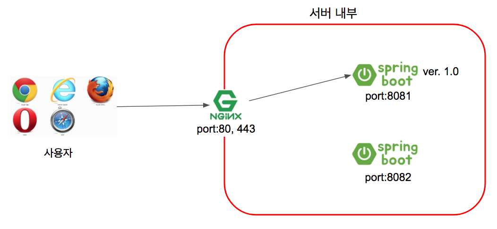
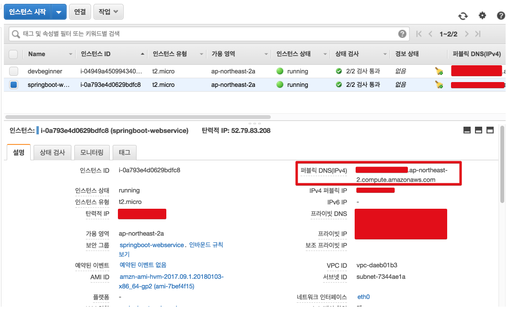

# 7. Nginx를 활용한 무중단 배포 구축하기

이번 시간엔 무중단 배포 환경을 구축하겠습니다.
(모든 코드는 [Github](https://github.com/jojoldu/springboot-webservice/tree/feature/7)에 있습니다.)  

## 7-1. 이전 시간의 문제점?

[이전 시간](http://jojoldu.tistory.com/265)에 저희는 스프링부트 프로젝트를 Travis CI를 활용하여 배포 자동화 환경을 구축해보았습니다.  
이젠 Master 브랜치에 Push만 되면 자동으로 빌드 & 테스트 & 배포가 자동으로 이루어집니다.  
하지만!  
배포하는 시간 동안은 어플리케이션이 종료가 됩니다.  
긴 시간은 아니지만, 새로운 Jar가 실행되기 전까진 기존 Jar를 종료시켜놓기 때문에 **서비스가 안됩니다.**  
하지만 **최근 웹 서비스들은 대부분 배포하기 위해 서비스를 정지시키는 경우가 없습니다**.  
어떻게 서비스의 정지 없이 배포를 계속 할 수 있는지 이번 시간에 확인하고 서비스에 적용해보겠습니다.

## 7-2. 무중단 배포?

예전에는 배포라고 하면 팀의 아주 큰 이벤트이기 때문에 다같이 코드를 합치는 날과 배포를 하는 날을 정하고 배포했습니다.  
(**배포만 전문으로 하는 팀**이 따로 있었습니다.)  
특히 배포일에는 사용자가 적은 **새벽 시간에 개발자들이 모두 남아 배포**를 해야만 했습니다.  
잦은 배포가 있어야 한다면 매 새벽마다 남아서 배포를 해야만 했는데, 배포를 하고나서 정말 치명적인 문제가 발견되면 어떻게 해야할까요?  
새벽시간에 부랴부랴 문제를 해결하다가, 사용자 유입이 많아 지는 아침이 되면 긴급점검을 올리고 수정해야만 했습니다.  
이렇게 배포가 서비스를 정지해야만 가능할때는 롤백조차 어렵기 때문에 개발자들이 정말 많이 고생하게 됩니다.  
그리고 서비스 입장에서도 배포만 했다하면 서비스가 정지되야 하니 곤혹스럽습니다.  
그래서 서비스를 정지하지 않고, 배포할 수 있는 방법들을 찾기 시작했는데요.  
이렇게 서비스를 정지시키지 않고, 배포를 계속하는 것을 **무중단 배포**라고 합니다.  


### 7-2-1. 무중단 배포 방법 소개

무중단 배포 방식에는 몇가지가 있습니다.

* [AWS 에서 Blue-Green 무중단 배포 구현](https://sangwook.github.io/2014/01/28/zero-downtime-blue-green-deployments-aws.html)
* [도커를 이용한 웹서비스 무중단 배포하기](https://subicura.com/2016/06/07/zero-downtime-docker-deployment.html)

이외에도 **L4 스위치를 이용한 무중단 배포**와 같이 IDC를 이용한 서비스에서 무중단 배포하는 방법등도 있지만, L4가 워낙 고가의 장비이다보니 대형 인터넷 기업외엔 쓸일이 잘 없습니다.  


> Tip)  
개인적으로 AWS 책 중 [실전 AWS 워크북](https://books.google.co.kr/books?id=v34zDwAAQBAJ&pg=PA147&lpg=PA147&dq=ELB%EB%A5%BC+%ED%99%9C%EC%9A%A9%ED%95%9C+%EB%B8%94%EB%A3%A8+%EA%B7%B8%EB%A6%B0+%EB%B0%B0%ED%8F%AC&source=bl&ots=ZjPWJeNiCX&sig=AiLs1WPKDM1W7gP-MeEfxRT3D3k&hl=ko&sa=X&ved=0ahUKEwjA2pqU-vvYAhWJgrwKHUn4C9AQ6AEIRDAF#v=onepage&q=ELB%EB%A5%BC%20%ED%99%9C%EC%9A%A9%ED%95%9C%20%EB%B8%94%EB%A3%A8%20%EA%B7%B8%EB%A6%B0%20%EB%B0%B0%ED%8F%AC&f=false)이 가장 도움이 많이 됐습니다.  
위 링크는 무중단 배포 (블루/그린 배포) 방식을 소개하고 있으니 꼭 참고하시면 좋을것 같습니다.

저희가 시도할 방법은 **Nginx를 이용한 무중단 배포** 입니다.

### 7-2-2. Nginx를 이용한 무중단 배포 방법 소개

Nginx를 이용한 무중단 배포를 하는 이유는 간단합니다.  
**가장 저렴하기 때문**입니다.  
(물론 사내에서 비용 지원이 빵빵하게 된다면 번거롭게 구축할 필요 없이 [AWS 블루그린 배포](https://books.google.co.kr/books?id=v34zDwAAQBAJ&pg=PA147&lpg=PA147&dq=ELB%EB%A5%BC+%ED%99%9C%EC%9A%A9%ED%95%9C+%EB%B8%94%EB%A3%A8+%EA%B7%B8%EB%A6%B0+%EB%B0%B0%ED%8F%AC&source=bl&ots=ZjPWJeNiCX&sig=AiLs1WPKDM1W7gP-MeEfxRT3D3k&hl=ko&sa=X&ved=0ahUKEwjA2pqU-vvYAhWJgrwKHUn4C9AQ6AEIRDAF#v=onepage&q=ELB%EB%A5%BC%20%ED%99%9C%EC%9A%A9%ED%95%9C%20%EB%B8%94%EB%A3%A8%20%EA%B7%B8%EB%A6%B0%20%EB%B0%B0%ED%8F%AC&f=false) 방식을 선택하시면 됩니다.)  

기존에 쓰던 EC2에 그대로 적용하면 되기 때문에 **배포를 위해 AWS EC2 인스턴스가 하나더 필요하지 않습니다**.  
추가로 이 방식은 꼭 AWS와 같은 **클라우드 인프라가 구축되있지 않아도 쓸수 있는 범용적인 방법**입니다.  
즉, 개인 서버 혹은 사내 서버에서도 동일한 방식으로 구축할 수 있기 때문에 사용처가 많습니다.  
(옛 고대의 선배님들이 많이들 쓰셨다고...)  
  
구조는 간단합니다.  
하나의 EC2 혹은 리눅스 서버에 **Nginx 1대와 스프링부트 jar를 2대를 사용하는 것**입니다.  
Nginx는 80(http), 443(https) 포트를 할당하고,  
스프링부트1은 8081포트로,  
스프링부트2는 8082포트로 실행합니다.  
그럼 아래와 같은 구조가 됩니다.



운영 과정은 다음과 같습니다.

* 사용자는 서비스 주소로 접속합니다 (80 혹은 443 포트)
* Nginx는 사용자의 요청을 받아 **현재 연결된 스프링부트로 요청을 전달**합니다.
  * 스프링부트1 즉, 8081 포트로 요청을 전달한다고 가정하겠습니다.
* 스프링부트2는 Nginx와 연결된 상태가 아니니 요청을 받지 못합니다.


* 1.1 버전으로 신규 배포가 필요하면 **Nginx와 연결되지 않은** 스프링부트2 (8082)로 배포합니다.
* 배포하는 동안에도 서비스는 중단되지 않습니다.
  * Nginx는 스프링부트1을 바라보기 때문입니다.
* 배포가 끝나고 정상적으로 스프링부트2가 구동중인지 확인합니다.
* 스프링부트2가 정상 구동중이면 ```nginx reload```를 통해 8081 대신에 8082를 바라보도록 합니다.
* **Nginx Reload는 1초 이내에 실행완료**가 됩니다.


* 또다시 신규버전인 1.2 버전의 배포가 필요하면 이번엔 스프링부트1로 배포합니다.
  * 현재는 스프링부트2가 Nginx와 연결되있기 때문입니다.
* 스프링부트1의 배포가 끝났다면 Nginx가 스프링부트1을 바라보도록 변경하고 ```nginx reload```를 실행합니다.
* 1.2 버전을 사용중인 스프링부트1로 Nginx가 요청을 전달합니다.

만약 배포된 1.2 버전에서 문제가 발생한다?  
그러면 바로 Nginx가 8082 포트(스프링부트2)를 보도록 변경하면 됩니다.


롤백 역시 굉장히 간단하게 처리할수 있습니다.  
대략 감이 오시나요?  

> Tip)  
이렇게 Nginx가 외부의 요청을 받아 뒷단 서버로 요청을 전달하는 행위를 **리버스 프록시**라고 합니다.  
이런 리버스 프록시 서버(Nginx)는 요청을 전달하고, 실제 요청에 대한 처리는 뒷단의 웹서버들이 처리합니다.  
대신 외부 요청을 뒷단 서버들에게 골고루 분배한다거나, 한번 요청왔던 js, image, css등은 캐시하여 리버스 프록시 서버에서 바로 응답을 주거나 등의 여러 장점들이 있습니다.  
자세한 설명은 [NginX로 Reverse-Proxy 서버 만들기 - Joinc](https://www.joinc.co.kr/w/man/12/proxy)를 참고하시면 좋습니다.

### 7-2-3. 무중단 배포 전체 구조

위 내용으로 무중단 배포까지 구축하게 되면 전체 구조는 아래처럼 됩니다.


(인프라 전체구조)  
  
기존 구조에서 EC2 내부의 구조만 변경되었으니 너무 크게 걱정하지 않으셔도 됩니다!  
자 그럼 이제 시작하겠습니다!

## 7-3. 무중단 배포 구축하기

먼저 Nginx를 설치하겠습니다.  

### 7-3-1. Nginx 설치

EC2에 접속해서 아래 명령어로 Nginx를 설치합니다.

```bash
sudo yum install nginx
```

설치가 완료되셨으면 아래 명령어로 Nginx를 실행합니다.

```bash
sudo service nginx start
```

Nginx 잘 실행되었는지 아래 명령어로 확인해봅니다.

```bash
ps -ef | grep nginx
```


Nginx가 잘 실행되었습니다!  
자 그럼 이제 외부에서 잘 노출되는지 확인해보겠습니다.  
AWS에서 EC2 Public DNS를 복사합니다.



(이제부터는 자주 접속할테니 즐겨찾기에 추가하시는걸 추천드립니다.)  
  
브라우저에 URL을 입력해보시면!


Nginx가 잘 설치된것을 확인할 수 있습니다.

